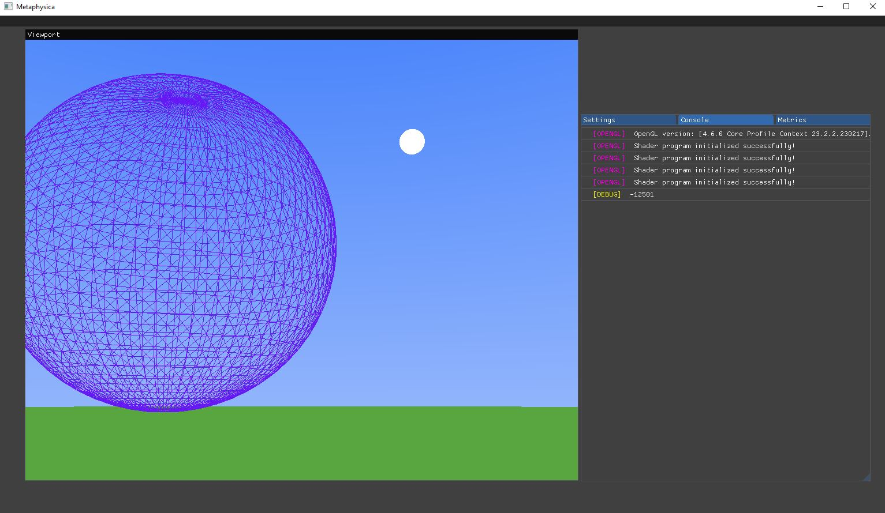
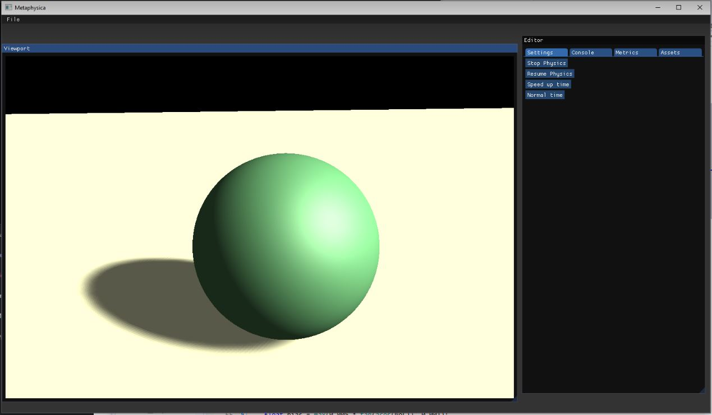

# Metaphysica
A simple 3D engine.

Currently in initial stages of development.
Developed in Visual Studio 22 with c++20, on Windows 10 64bit

--
Basic object rendering and 3d movement

--
Blinn-Phong shading and Shadow Mapping

